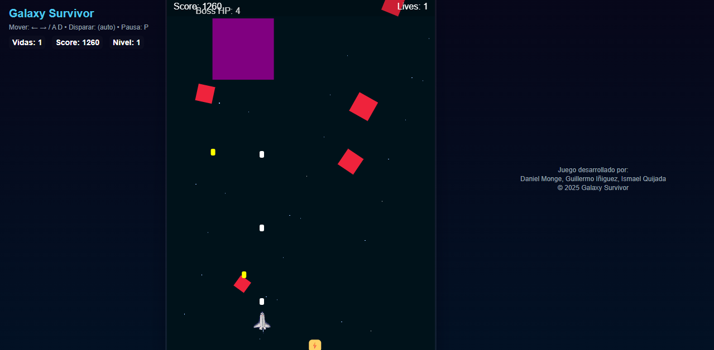
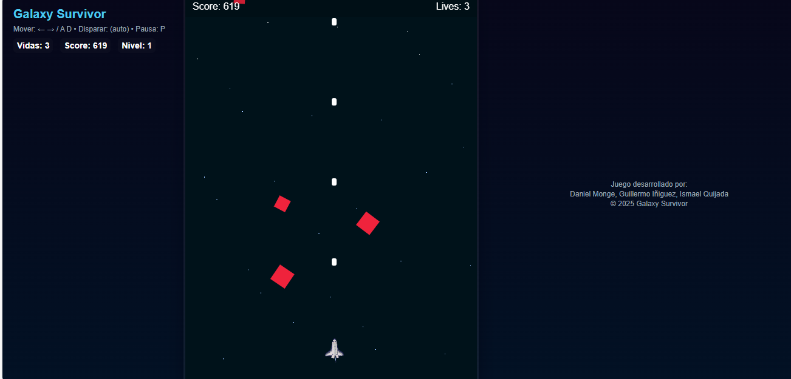
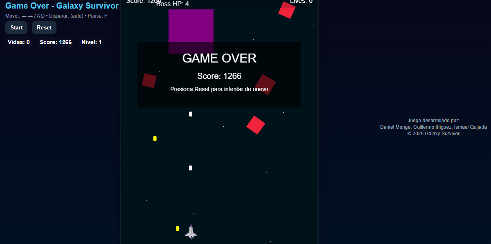

# 🌌 Galaxy Survivor

**Galaxy Survivor** es un videojuego arcade 2D desarrollado en **HTML, CSS y JavaScript**, donde el jugador controla una nave espacial y debe sobrevivir el mayor tiempo posible esquivando y destruyendo meteoritos, enfrentándose a enemigos y a un **Boss** que aparece cada cierto puntaje.

🔗 **Juego en línea (GitHub Pages):**
👉 [https://danielmonge12.github.io/Galaxy-Survivor/](https://danielmonge12.github.io/Galaxy-Survivor/)

---

## 🎮 Instrucciones para jugar / instalar

### ▶️ Opción 1: Jugar en línea (recomendado)

1. Abre el siguiente enlace en tu navegador:

   * [https://danielmonge12.github.io/Galaxy-Survivor/](https://danielmonge12.github.io/Galaxy-Survivor/)
2. Presiona el botón **Start**.
3. Usa las teclas para jugar:

   * ⬅️ / ➡️ o **A / D** → Mover la nave
   * Disparo automático
   * **P** → Pausar / Reanudar
4. Sobrevive, derrota enemigos y enfrenta al Boss.

### 💻 Opción 2: Ejecutar localmente

1. Descarga el proyecto desde GitHub:

```bash
git clone https://github.com/DanielMonge12/Galaxy-Survivor.git
```

2. Abre la carpeta del proyecto.
3. Abre el archivo `index.html` con cualquier navegador web.

---

## 📦 Aplicación y medio de almacenamiento

* **Tipo:** Videojuego Web
* **Tecnologías:** HTML5, CSS3, JavaScript
* **Almacenamiento:** Repositorio GitHub
* **Despliegue:** GitHub Pages

El proyecto puede almacenarse y distribuirse como:

* Carpeta comprimida (.zip)
* Repositorio GitHub
* Enlace web funcional (GitHub Pages)

---

## 🖼️ Evidencias visuales (Printscreen)

### Pantalla de inicio / Jugabilidad



### Enemigos y meteoritos



### Pantalla de Game Over



---

## 🎥 Evidencia en video (individual)

Cada integrante grabó un **video corto** donde:

* Se ve su rostro o iniciales
* Juega una partida de Galaxy Survivor
* Explica brevemente su participación en el proyecto

**Formato sugerido:**

* Duración: 1–2 minutos
* Grabación de pantalla con cámara o sesión remota

---

## 🧑‍💻 Video general del equipo

Video grupal donde:

* Se muestra el videojuego funcionando
* Aparecen los **créditos dentro del juego**
* Se incluyen los nombres de los integrantes

📌 Los créditos se muestran en la sección de **Créditos** del videojuego.

---

## 🏷️ Release final

**Versión:** v1.0

### Cambios incluidos en esta versión:

* Jugabilidad completa
* Sistema de score y vidas
* Música de fondo y efectos de sonido
* Enemigos con dificultad progresiva
* Boss con ataques y daño al jugador
* Pantalla de Game Over
* Créditos del equipo
* Despliegue en GitHub Pages

---

## 👥 Equipo de desarrollo

* **Daniel Monge** – Gestión del repositorio y desarrollo general
* **Guillermo Íñiguez** – Lógica del juego
* **Ismael Quijada** – Sonidos y recursos visuales

---

## 📚 Observaciones finales

Este proyecto fue desarrollado como evidencia académica, aplicando el uso de **Git y GitHub**, trabajo colaborativo, control de versiones y publicación de una aplicación funcional en la web.

✅ Proyecto completamente funcional y documentado.

---

✨ *Gracias por jugar Galaxy Survivor* 🚀
